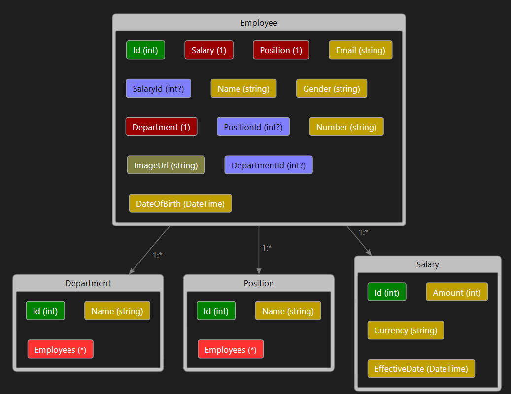

# HR-System-ASP.NET

## ERD:



The HR System ASP.NET MVC project is designed to manage employee information, including details about positions, salaries, and departments. Additionally, the project features an admin dashboard that displays various statistics about the website.

## To use the application:
- Add a new migration to instantiate the database, (in the package manager console):
```
add-migration MigrationName
```
- Update the database:
```
update-database
```

- Admin account should be instantiated after a new migration, by going to "claim Admin privileges" from the navbar (only need to be done once).
- New users should be approved by the Admin after registering.

note: this angular project is an extension for the website, that shows all of the employees with their details in a responsive way:
https://github.com/Hasan-Mufdy/HR-System-Angular

### Features:
- Employee management
- Position and department tracking
- Salary information
- Admin dashboard with statistics

Main Models:
- Employee
- Position
- Department
- Salary
- AdminViewModel


