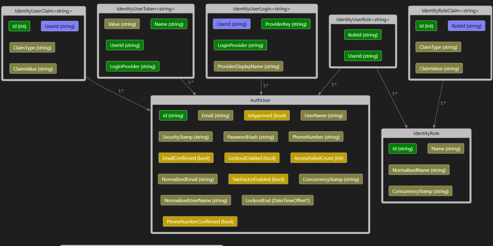

# HR-System-ASP.NET

## ERD:

The HR System ASP.NET MVC project is designed to manage employee information, including details about positions, salaries, and departments. Additionally, the project features an admin dashboard that displays various statistics about the website.

note: this angular project is an extension for the website, that shows all of the employees with their details in a responsive way:
https://github.com/Hasan-Mufdy/HR-System-Angular

### Features:
- Employee management
- Position and department tracking
- Salary information
- Admin dashboard with statistics

Main Models:
- Employee
- Position
- Department
- Salary
- AdminViewModel

